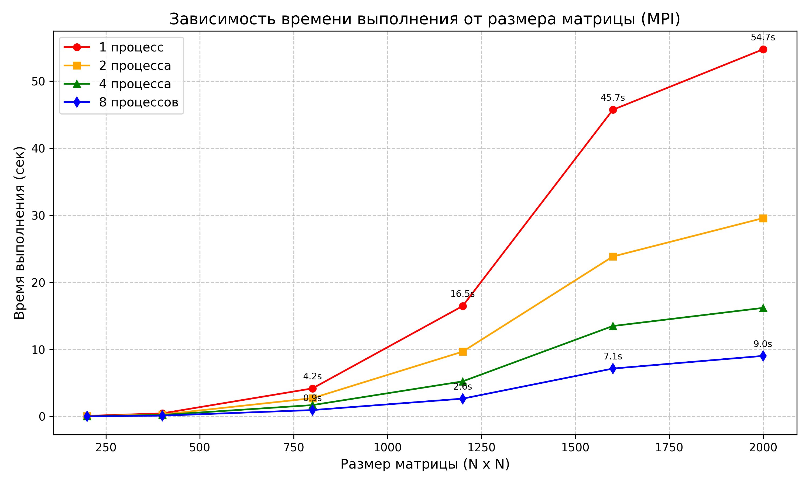
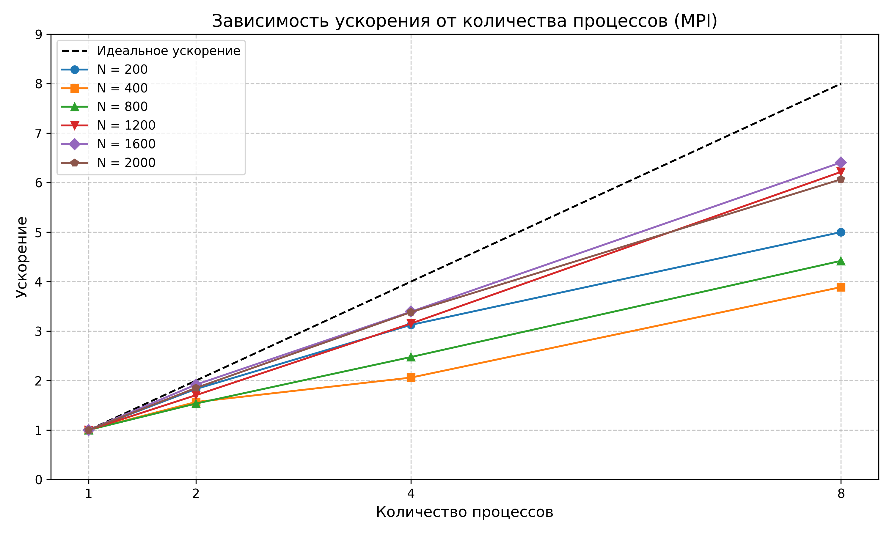
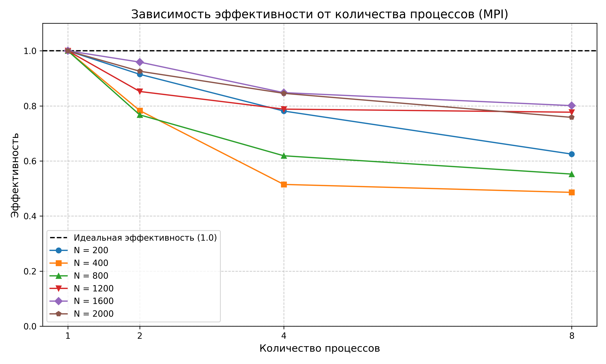

# Параллельное программирование - Лабораторная работа №3
## Есипов Никита - 6211

### Цель работы
Модифицировать программу из л/р №1 для параллельной работы по технологии MPI.

---

* `Matrix.h` - содержит класс матриц с методами для работы с ними.
* `main.cpp` - C++ программа для вычисления произведения двух матриц и записи результата в новый файл (реализовано умножение матриц с помощью MPI).
* `verify.py` - Python программа для проверки результата, полученного в C++, с помощью библиотеки NumPy с допущением погрешностей.
* `InputA.txt`, `InputB.txt` - образец квадратных матриц, с размером 1200, для перемножения.
* `Output.txt` - результат перемножения матриц из образца, используя MPI (4 процесса).

---

### Использование программы C++
Для подсчёта произведений матриц с использованием MPI необходимо скомпилировать и запустить `main.exe` через `mpiexec`.
```
Пример запуска: mpiexec -n 1 ./main.exe
    где -n - количество процессов
```

После запуска программы в консоль будет выведена информация о время перемножения матриц всех размеров с указанием:
* количества использованных процессов
* занятого времени

Пример результата - `results.txt`

Так же будут сохранены исходные матрицы 1200x1200 и результат их умножения используя MPI (4 процесса) для проверки.

---

### Результат экспериментов
	Процессор: i7-2600 (3.88 GHz) (4 физических ядра, 8 логических потоков. Технология Hyper-Threading)

### Время выполнения (сек)
| Объем задачи (N) | 1 процесс | 2 процесса | 4 процесса | 8 процессов |
| :--- | :--- | :--- | :--- | :--- |
| 200 | 0.065 | 0.033 | 0.017 | 0.016 |
| 400 | 0.520 | 0.261 | 0.139 | 0.166 |
| 800 | 4.776 | 2.961 | 1.887 | 1.632 |
| 1200 | 21.262 | 10.755 | 6.511 | 5.600 |
| 1600 | 58.881 | 30.876 | 17.051 | 15.137 |
| 2000 | 116.137 | 57.877 | 34.948 | 30.037 |

### Зависимость ускорения от количества процессов
| Объем задачи (N) | 1 процесс | 2 процесса | 4 процесса | 8 процессов |
| :--- | :--- | :--- | :--- | :--- |
| 200 | 1.000 | 1.970 | 3.824 | 4.062 |
| 400 | 1.000 | 1.992 | 3.741 | 3.133 |
| 800 | 1.000 | 1.613 | 2.531 | 2.926 |
| 1200 | 1.000 | 1.977 | 3.266 | 3.797 |
| 1600 | 1.000 | 1.907 | 3.453 | 3.890 |
| 2000 | 1.000 | 2.007 | 3.323 | 3.866 |

### Зависимость эффективности от количества процессов
| Объем задачи (N) | 1 процесс | 2 процесса | 4 процесса | 8 процессов |
| :--- | :--- | :--- | :--- | :--- |
| 200 | 1.000 | 0.985 | 0.956 | 0.508 |
| 400 | 1.000 | 0.996 | 0.935 | 0.392 |
| 800 | 1.000 | 0.806 | 0.633 | 0.366 |
| 1200 | 1.000 | 0.988 | 0.816 | 0.475 |
| 1600 | 1.000 | 0.954 | 0.863 | 0.486 |
| 2000 | 1.000 | 1.003 | 0.831 | 0.483 |
    
---

### Графики результатов






---

### Реализация параллельной работы по технологии MPI (внутри main.cpp)

```cpp
#include <mpi.h>

//Sync - start
MPI_Barrier(MPI_COMM_WORLD);
double start_time = MPI_Wtime();

//Broadcast B matrix
MPI_Bcast(B.get_data(), size* size, MPI_DOUBLE, 0, MPI_COMM_WORLD);

//Scatter A matrix
double* send_ptr_A = nullptr;
if (rank == 0) {
    send_ptr_A = A.get_data();
}
MPI_Scatter(send_ptr_A, local_matrix_size, MPI_DOUBLE, //From
    local_A.data(), local_matrix_size, MPI_DOUBLE, //To
    0, MPI_COMM_WORLD);

//Multiple local matrices
for (int i = 0; i < rows_for_proc; ++i) {
    for (size_t j = 0; j < size; ++j) {
        double sum = 0.0;
        for (size_t k = 0; k < size; ++k) {
            sum += local_A[i * size + k] * B(k, j);
        }
        local_C[i * size + j] = sum;
    }
}

//Gather C matrix
double* recv_ptr_C = nullptr;
if (rank == 0) {
    recv_ptr_C = C.get_data();
}
MPI_Gather(local_C.data(), local_matrix_size, MPI_DOUBLE, //From
    recv_ptr_C, local_matrix_size, MPI_DOUBLE, //To
    0, MPI_COMM_WORLD);

//Sync - end
MPI_Barrier(MPI_COMM_WORLD);
double end_time = MPI_Wtime();
```

---

### Для верификации необходимо запустить verify.py
Можно задать аргументы:

* `-a`      Путь первой матрицы для перемножения (по умолчанию `InputA.txt`).
* `-b`      Путь второй матрицы для перемножения (по умолчанию `InputB.txt`)
* `-o`      Путь сохранения полученной матрицы (по умолчанию `Output.txt`)

```
Пример запуска: python verify.py -a InputA.txt -b InputB.txt -o Output.txt
Пример запуска: python verify.py
```

В данной лабораторной работе результат проверил только на одной из матриц, а именно при перемножении матриц 1200x1200 с использованием MPI (4 процессов) - результат сошёлся. Посчитал этого достаточным доказательством того, что алгоритм не вносит ошибок при рассылке MPI_Scatter и сборке MPI_Gather и работает правильно.

---

### Выводы
* Была реализована программа параллельного перемножения квадратных матриц на языке C++ с использованием MPI.
* Лучшее ускорение: 4.062 при 8 процессах на матрицах 200x200. Нелинейный рост ускорения после 4 процессов объясняется архитектурой процессора - всего 4 ядра.
* Лучшая эффективность: 1.003 при 2 процессах на матрицах 2000x2000.
* При матрицах небольших размеров, использование большого количества процессов не имеет смысла, из-за того что время на передачу данных (MPI_Bcast, Scatter, Gather) между процессами соизмеримо с временем вычисления матрицы. (Видно на матрице 400x400 на четырех и восьми процессах).
* Есть автоматическая верификация, написанная на Python с использованием библиотеки NumPy. Результаты совпали с заданной точностью, что подтверждает правильность написанного алгоритма.