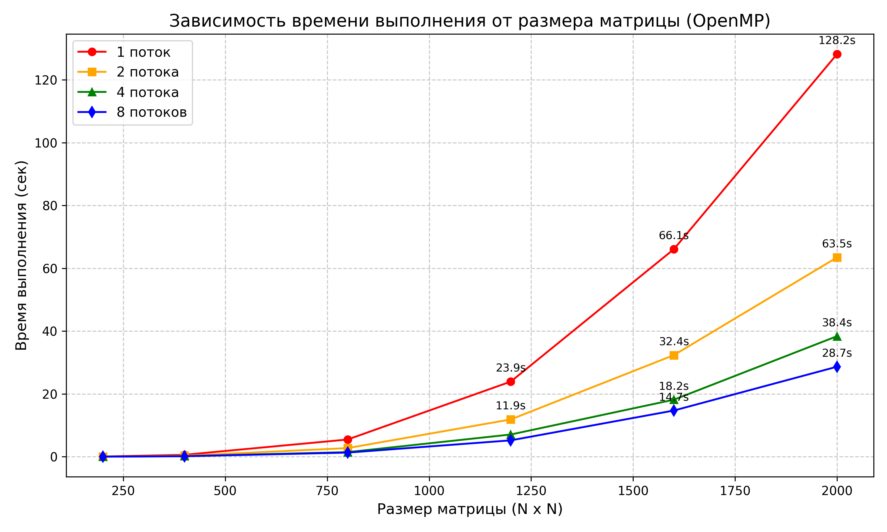
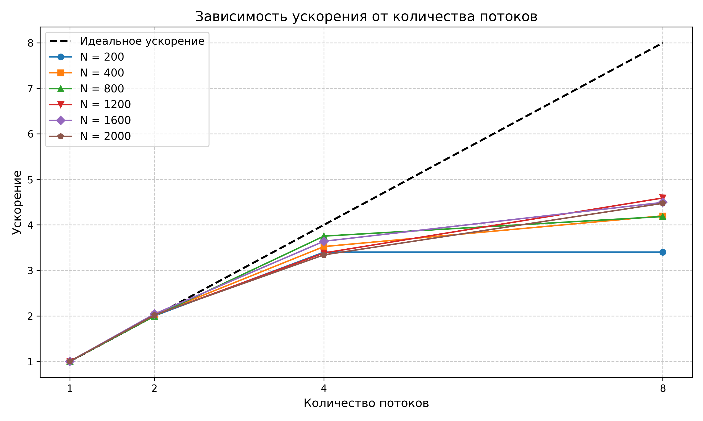
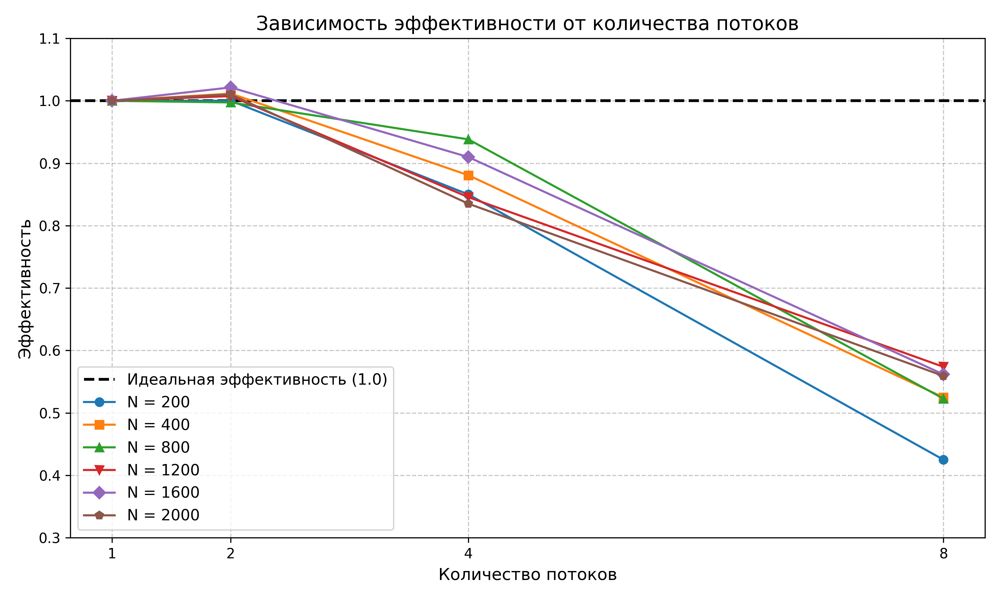

# Параллельное программирование - Лабораторная работа №2
## Есипов Никита - 6211

### Цель работы
Модифицировать программу из л/р №1 для параллельной работы по технологии OpenMP.

---

* `Matrix.h` - содержит класс матриц с методами для работы с ними (реализован метод для умножения с помощью OpenMP).
* `main.cpp` - C++ программа для вычисления произведения двух матриц и записи результата в новый файл.
* `verify.py` - Python программа для проверки результата, полученного в C++, с помощью библиотеки NumPy с допущением погрешностей.
* `exampleInputA.txt`, `exampleInputB.txt` - образец квадратных матриц, с размером 1200, для перемножения.
* `example4threadsOpenMPOutput.txt` - результат перемножения матриц из образца, используя OpenMP (4 потока).

---

### Использование программы C++
Для подсчёта произведений матриц с использованием OpenMP необходимо скомпилировать и запустить `main.exe`.

После запуска программы в консоль будет выведена информация о время перемножения матриц всех размеров с указанием:
* количества использованных потоков
* занятого времени
* ускорения
* эффективности

Пример результата - `results.txt`

Так же будут сохранены исходные матрицы 1200x1200 и результат их умножения используя OpenMP (4 потока).

---

### Результат экспериментов
	Процессор: i7-2600 (3.88 GHz) (4 физических ядра, 8 логических потоков. Технология Hyper-Threading)

### Время выполнения (сек)
Объем задачи (N) | 1 поток | 2 потока | 4 потока | 8 потоков |
| :--- | :--- | :--- | :--- | :--- |
| 200 | 0.068 | 0.034 | 0.020 | 0.020 |
| 400 | 0.613 | 0.303 | 0.174 | 0.146 |
| 800 | 5.479 | 2.747 | 1.460 | 1.310 |
| 1200 | 23.916 | 11.869 | 7.071 | 5.210 |
| 1600 | 66.084 | 32.351 | 18.158 | 14.707 |
| 2000 | 128.198 | 63.453 | 38.375 | 28.659 |

### Зависимость ускорения от количества потоков
| Объем задачи (N) | 1 поток | 2 потока | 4 потока | 8 потоков |
| :--- | :--- | :--- | :--- | :--- |
| 200 | 1.000 | 1.983 | 3.341 | 3.408 |
| 400 | 1.000 | 2.027 | 3.534 | 4.202 |
| 800 | 1.000 | 1.994 | 3.752 | 4.182 |
| 1200 | 1.000 | 2.015 | 3.382 | 4.591 |
| 1600 | 1.000 | 2.043 | 3.639 | 4.493 |
| 2000 | 1.000 | 2.020 | 3.341 | 4.473 |

### Зависимость эффективности от количества потоков
| Объем задачи (N) | 1 поток | 2 потока | 4 потока | 8 потоков |
| :--- | :--- | :--- | :--- | :--- |
| 200 | 1.000 | 0.992 | 0.835 | 0.426 |
| 400 | 1.000 | 1.014 | 0.883 | 0.525 |
| 800 | 1.000 | 0.997 | 0.938 | 0.523 |
| 1200 | 1.000 | 1.007 | 0.846 | 0.574 |
| 1600 | 1.000 | 1.021 | 0.910 | 0.562 |
| 2000 | 1.000 | 1.010 | 0.835 | 0.559 |

---

### Графики результатов






---

### Реализация параллельной работы по технологии OpenMP (внутри Matrix.h)

```cpp
#include <omp.h>

//

template <typename T>
Matrix<T> Matrix<T>::multiply_omp(const Matrix& src, int num_threads) const {
	if (size != src.size) {
		throw std::invalid_argument("Matrix dimensions different.");
	}

	Matrix<T> result(size);

	omp_set_num_threads(num_threads);

	int n = static_cast<int>(size);

	#pragma omp parallel for
	for (int i = 0; i < n; ++i) {
		for (size_t j = 0; j < size; ++j) {
			T sum = 0;
			for (size_t k = 0; k < size; ++k) {
				sum += (*this)(i, k) * src(k, j);
			}
			result(i, j) = sum;
		}
	}

	return result;
}
```

---

### Для верификации необходимо запустить verify.py
Можно задать аргументы:

* `-a`      Путь первой матрицы для перемножения (по умолчанию `InputA.txt`).
* `-b`      Путь второй матрицы для перемножения (по умолчанию `InputB.txt`)
*  `-o`      Путь сохранения полученной матрицы (по умолчанию `Output.txt`)

```
Пример запуска: python verify.py -a exampleInputA.txt -b exampleInputB.txt -o example4threadsOpenMPOutput.txt
```

В данной лабораторной работе результат проверил только на одной из матриц, а имеено при перемножении матриц 1200x1200 с использованием OpenMP (4 потока) - результат сошёлся. Посчитал этого достаточным доказательством того, что распараллеливание работает правильно.

---

### Выводы
* Была реализована программа параллельного перемножения квадратных матриц на языке C++ с использованием OpenMP.
* Лучшее ускорение: 4.591 при 8 потоках на матрицах 1200x1200. Нелинейный рост ускорения после 4 потоков объясняется архитектурой процессора - всего 4 ядра.
* Лучшая эффективность: 1.021 при 2 потоках на матрицах 1600x1600.
* При матрицах небольших размеров, использование большого количества потоков не имеет смысла, из-за того что время на создание и синхронизацию самих потоков соизмеримо с временем вычисления матрицы.
* Есть автоматическая верификация, написанная на Python с использованием библиотеки NumPy. Результаты совпали с заданной точностью, что подтверждает правильность написанного алгоритма.
