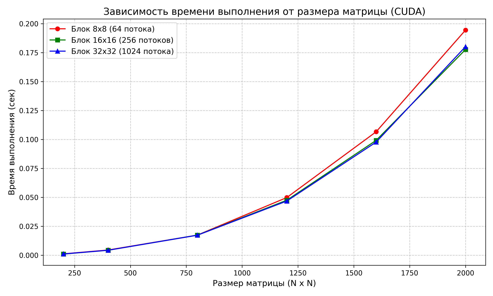
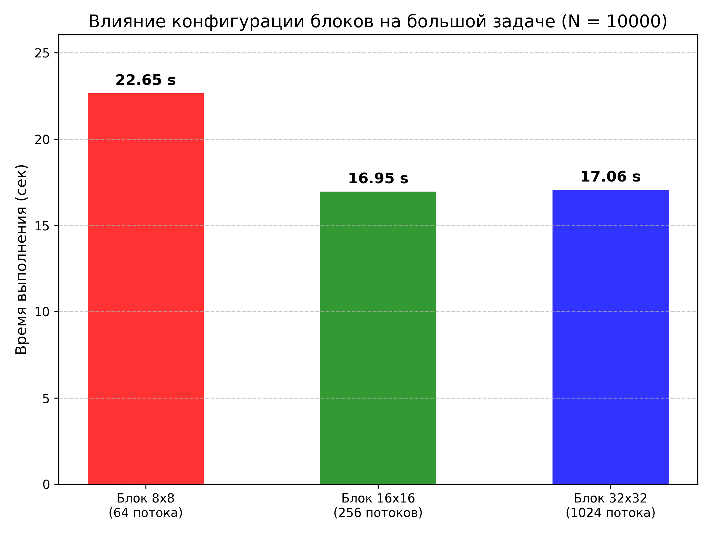

# Параллельное программирование - Лабораторная работа №4
## Есипов Никита - 6211

### Цель работы
Модифицировать программу из л/р №1 для параллельной работы по технологии CUDA.

---

* `Matrix.cuh` - содержит класс матриц с методами для работы с ними (реализовано умножение матриц с помощью CUDA).
* `main.cu` - C++ программа для вычисления произведения двух матриц и записи результата в новый файл.
* `verify.py` - Python программа для проверки результата, полученного в C++, с помощью библиотеки NumPy с допущением погрешностей.
* `InputA.txt`, `InputB.txt` - образец квадратных матриц, с размером 1200, для перемножения.
* `Output.txt` - результат перемножения матриц из образца, используя CUDA (Блок 16*16).

---

### Использование программы C++
Для подсчёта произведений матриц с использованием CUDA необходимо скомпилировать и запустить main.exe.

После запуска программы в консоль будет выведена информация о время перемножения матриц всех размеров с указанием:
* конфигурацией блоков для умножения
* занятого времени

Пример результата - `results.txt`

Так же будут сохранены исходные матрицы 1200x1200 и результат их умножения используя CUDA (Блок 16*16) для проверки.

---

### Результат экспериментов
	Процессор: i7-2600 (3.88 GHz) (4 физических ядра, 8 логических потоков. Технология Hyper-Threading)
    Видеокарта: GTX 1060 3 GB GDDR5 (Palit JetStream) (1152 CUDA cores)

### Время выполнения на GPU (сек)
| Объем задачи (N) | Блок 8x8 | Блок 16x16 | Блок 32x32 |
| :--- | :--- | :--- | :--- |
| 200 | 0.0012 | 0.0010 | 0.0011 |
| 400 | 0.0045 | 0.0043 | 0.0043 |
| 800 | 0.0174 | 0.0174 | 0.0173 |
| 1200 | 0.0498 | 0.0475 | 0.0468 |
| 1600 | 0.1066 | 0.0992 | 0.0977 |
| 2000 | 0.1944 | 0.1776 | 0.1801 |
| 10000 | 22.6527 | 16.9523 | 17.0630 |
    
---

### Графики результатов




---

### Реализация параллельной работы по технологии CUDA (внутри Matrix.cuh)

```cpp
#include <cuda_runtime.h>

template <typename T>
__global__ void KernelMultiplication(const T* A, const T* B, T* C, int N) {
	int row = blockIdx.y * blockDim.y + threadIdx.y;
	int col = blockIdx.x * blockDim.x + threadIdx.x;

	if (row < N && col < N) {
		T sum = 0;
		for (int k = 0; k < N; ++k) {
			sum += A[row * N + k] * B[k * N + col];
		}
		C[row * N + col] = sum;
	}
}

template <typename T>
Matrix<T> Matrix<T>::multiply_cuda(const Matrix& src, int block_size) const {
	if (size != src.size) {
		throw std::invalid_argument("Matrix dimensions different.");
	}

	Matrix<T> result(size);
	int n = static_cast<int>(size);
	//Memory needed
	size_t bytes = n * n * sizeof(T);

	T* A, * B, * C;
	
	//Allocate memory
	cudaMalloc(&A, bytes);
	cudaMalloc(&B, bytes);
	cudaMalloc(&C, bytes);

	//Matrix copy
	cudaMemcpy(A, data, bytes, cudaMemcpyHostToDevice);
	cudaMemcpy(B, src.data, bytes, cudaMemcpyHostToDevice);

	//Grid and blocks
	dim3 threadsPerBlock(block_size, block_size);
	dim3 blocksPerGrid((n + block_size - 1) / block_size, (n + block_size - 1) / block_size);

	//Multiply
	KernelMultiplication<T> << <blocksPerGrid, threadsPerBlock >> > (A, B, C, n);

	//Sync
	cudaDeviceSynchronize();

	//Copy result
	cudaMemcpy(result.data, C, bytes, cudaMemcpyDeviceToHost);

	//Free memory
	cudaFree(A);
	cudaFree(B);
	cudaFree(C);

	return result;
}
```

---

### Для верификации необходимо запустить verify.py
Можно задать аргументы:

* `-a`      Путь первой матрицы для перемножения (по умолчанию `InputA.txt`).
* `-b`      Путь второй матрицы для перемножения (по умолчанию `InputB.txt`)
* `-o`      Путь сохранения полученной матрицы (по умолчанию `Output.txt`)

```
Пример запуска: python verify.py -a InputA.txt -b InputB.txt -o Output.txt
Пример запуска: python verify.py
```

В данной лабораторной работе результат проверил только на одной из матриц, а именно при перемножении матриц 1200x1200 с использованием CUDA (Блок 16*16) - результат сошёлся. Посчитал этого достаточным доказательством того, что логика распределения потоков работает правильно.

---

### Выводы
* Была реализована программа параллельного перемножения квадратных матриц на языке C++ с использованием CUDA.
* Блок 16x16 оказался самым эффективным. Блок 32x32 оказался почти таким же эффективным, однако он может ограничивать количество активных блоков.
* При небольших размерах матриц разницы между разными видами блоков почти нет. Основное время затрачивается на передачу данных по памяти, а не на сами вычисления. Видно примерно до N = 800.
* Есть автоматическая верификация, написанная на Python с использованием библиотеки NumPy. Результаты совпали с заданной точностью, что подтверждает правильность написанного алгоритма.
* Был проведен эксперимент на перемножение матрицы с размером в 10.000, что заняло всего менее 17 секунд, на CPU последовательным алгоритмом это заняло бы несколько часов.